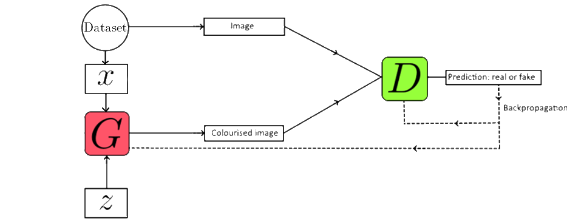
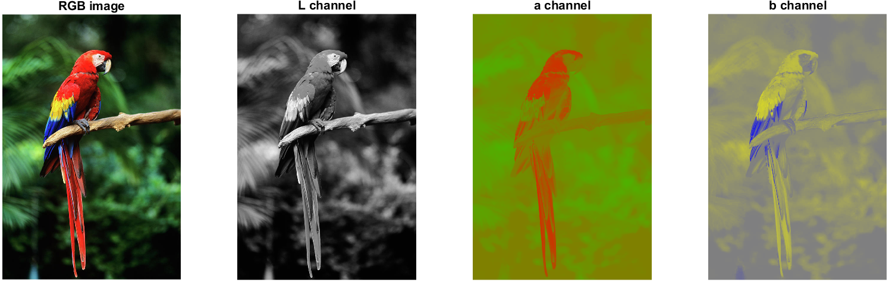

# Image Colourization with conditional GANs
Repository for our image colourization 🖍🎨 project in the Deep Learning course (02456) at DTU. 

You can find our poster [here](poster/02456_Deep_Learning_Image_Colourization.pdf).

# Background
We use conditional Generative Adversarial Networks (GANs) to colourise black/white images. A GAN consists of a generator $`(G)`$ that generates colourised images and a discriminator $`(D)`$ that predicts if the generated image is real or generated by the generator.

 The generator and discriminator are trained simultaneously in an adversarial manner using the following GAN loss:
```math
  \mathcal{L}(G,D) = \min_{G} \max_{D} \mathbb{E}_{x, y}[\log D(x, y)]\\
    +\mathbb{E}_{x, z}[\log (1-D(x, G(x, z)))] + \lambda \mathbb{E}_{x, y, z}\left[\|y-G(x, z)\|_{p}\right]
```
The loss encourages the generator to generate better images and the discriminator to become better at discriminating between real and fake images. The last term is a regularisation term weighted by the value $`\lambda`$.

Images are represented in the Lab colour space, instead of the more common RGB colour space. The goal of the generator is then to predict the $`a`$ and $`a`$ colour channels, which reduces the dimensionality of the problem from $`256^3`$ to $`256^2`$.
<center></center>
<p align="center">Visualisation of L, A, and B colour channels for an example image.<p align="center">

# Milestones
- [x] Data: use the places365 dataset (remove BW images)
- [x] Make the baseline (GAN and L1-loss without transfer learning)
- [x] Test difference between L1 and L2 loss on baseline model
- [x] 2 backbones VGG19, Xception
- [x] Quantitative evaluation (colourfulness, peak signal-to-noise ratio (PSNR))
- [x] Qualitative human evaluation (by us) on 5 images each 
- [ ] Use image labels as additional conditional data and assess improvement
- [ ] Evaluate how image label data improved the model

# Training your own model on HPC cluster
The Places365 dataset is available [here](http://places2.csail.mit.edu/): 

$ are terminal commands
1. open terminal in same folder as this project and type the following commands (you can paste them into the terminal with middle mouse click)
2. ```$ module load python3/3.9.6```
3. ```$ module load cuda/11.3```
4. ```$ python3 -m venv DeepLearning```
5. ```$ source DeepLearning/bin/activate```
6. ```$ pip3 install -r requirements.txt```

Now everything should be setup. Submit shell script ```HPC/submit.sh``` to start training your model.

# Results
